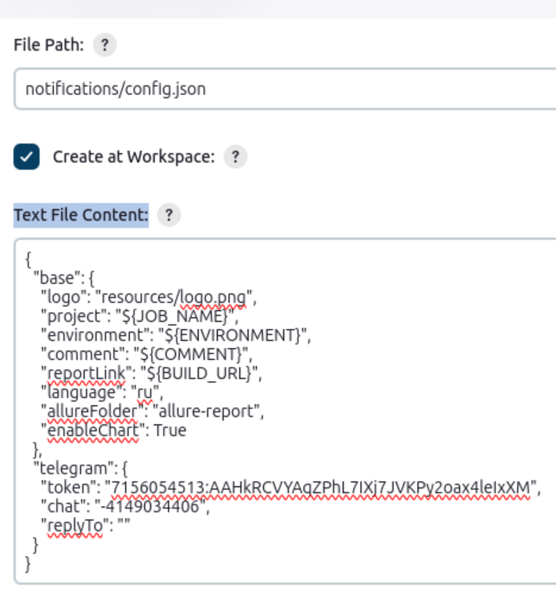

# QA.GURU | Python | Автоматизация тестирования 10 поток
### Table of contents  
[]()
[Lesson 7: Working with files](https://school.qa.guru/pl/teach/control/lesson/view?id=314614372)

[Lesson 8: Python Basics. OOP](https://school.qa.guru/pl/teach/control/lesson/view?id=320830619)

[Lesson 9: Allure report](https://school.qa.guru/pl/teach/control/lesson/view?id=321205612)

[Lesson 10: Page object:](https://school.qa.guru/pl/teach/control/lesson/view?id=321374863)  
    [Lesson 10: Homework  mid-level-step-objects](https://github.com/svmyhome/demoqa10-e2e-tests/tree/lesson_10_mid-level-step-objects)  
    [Lesson 10: Homework high-level-step-objects](https://github.com/svmyhome/demoqa10-e2e-tests/tree/lesson_10_high-level-step-objects)  
    [Lesson 10: HomeWork application-manager](https://github.com/svmyhome/demoqa10-e2e-tests/tree/lesson_10_application-manager)  

[Lesson 11: Page object](https://school.qa.guru/pl/teach/control/lesson/view?id=321671178)  

[Lesson 12: Jenkins First Task](https://school.qa.guru/pl/teach/control/lesson/view?id=321892208)    

[Lesson 13: Jenkins run witn parameters](https://school.qa.guru/pl/teach/control/lesson/view?id=322004438)    

[Lesson 14: Telegram bot](https://school.qa.guru/pl/teach/control/lesson/view?id=322556453)    

[Lesson 15: Fast develop](https://school.qa.guru/pl/teach/control/lesson/view?id=314614384)   

[Lesson 16: Pytest](https://school.qa.guru/pl/teach/control/lesson/view?id=323933081) 

[Lesson 17: Selenoid](https://school.qa.guru/pl/teach/control/lesson/view?id=324167375) 

[Lesson 18: Venv, Poetry](https://school.qa.guru/pl/teach/control/lesson/view?id=324486634) 

[Lesson 19: Rest API part 1](https://school.qa.guru/pl/teach/control/lesson/view?id=314614389) 

[Lesson 20: Rest API part 2](https://school.qa.guru/pl/teach/control/lesson/view?id=314614390) 

[Lesson 21: Mobile automation](https://school.qa.guru/pl/teach/control/lesson/view?id=325311308) 

### Hot keys pyCharm
Alt + shift + E в режиме дебага выполнить одну строку

### Зафризить форму
остановка JavaScripts or перейти в настройки хром три точки->More tools->Rendering->Emulate a focuse page
setTimeout(()=> { debugger; }, 2000);

### CSS

выбор одного из нескольких классов
[class~=react-datepicker__year-select] OR .react-datepicker__year-select

выбор нескольких классов
.react-datepicker__day--025.react-datepicker__day--weekend


### Python commands
python3 -m venv .venv - создает виртуальное окружение через коммандную строку source .venv/bin/activate - активирует виртуальное окружение

### Work with files

### Allure report

The Allure report did not generate a report if run locally. But this script generates local allure reports with history trends.
https://github.com/aleksandr-kotlyar/local-allure-history-trends-bash

Дополнительная библиотека 
bash allure_generate.sh tests/allure-results/

allure open allure

### Pydantic
берет данные из .env если файла нет не ругается, а берет из самого pydentic определенного в project.py
как запускать из строки  
base_url='https://google.com/' timeout='10.0' pytest tests  
driver_name=firefox pytest tests  
env -S 'driver_name=firefox' pytest tests  
context=stage pytest tests  

### Jenkins

Execute shell
```
python -m venv .venv
source .venv/bin/activate
pip install poetry
poetry install
pytest .
```
```
python -m venv .venv
source .venv/bin/activate
pip install poetry
poetry install
pytest ${TEST_FOLDER} --browser_version=${BROWSER_VERSION}
```

pytest tests/ --browser_version=99


### telegram -bot
Text File Content:
```
{
  "base": {
    "logo": "resources/logo.png",
    "project": "${JOB_NAME}",
    "environment": "${ENVIRONMENT}",
    "comment": "${COMMENT}",
    "reportLink": "${BUILD_URL}",
    "language": "ru",
    "allureFolder": "allure-report",
    "enableChart": True
  },
  "telegram": {
    "token": "7126054513:AFHkRCVYAqZPhL7IXj7JVKPy2oax4leIxXM",
    "chat": "-4149033206",
    "replyTo": ""
  }
}
```



### Lesson 15: Fast develop
https://devicon.dev/

### Lesson 16: pytest

#### Аргументы запуска и марки
--co не запускает, но собирает и отображает тесты которые будут запущены
pytest --co

-k фильтрует тесты по определенному слову, набору слов   
pytest --co -k skip_1
pytest --co -k "skip or 1"

-m фильтрует по @pytest.mark.fast ... @pytest.mark... 
Необходимо явно регистрировать pyproject.toml markers=["fast: Описание", "...."] 
pytest --co -m slow
pytest --co -m "slow or fast"

--markers выводит все возможные марки

--fixtures выводит все фикстуры

--duration=10 печатает 10 самых долгих тестов
pytest . --durations=10

-v показывает расширенный лог

-l -список всех переменных со значением
pytest tests/simple/test_simple_fail.py -l

--setup-plan покажет план запуска включая подготовку и завершение
pytest test_simple.py --setup-plan

addopts="-l -v --durations=10" вместо строки можно описать в pyproject.toml

#### Пропуск файлов

skip - удобно помечать тесты не готовой функциональности или тесты которые нет необходимости запускать в этом прогоне
```
@pytest.mark.skip 
@pytest.mark.skip("TASK-1234 Тест нестабильный потому что время от времени не хватает таймаута")
@pytest.mark.skip(reason="TASK-1234 Тест нестабильный потому что время от времени не хватает таймаута")
```

skipif - пропуск по условию. Лучше всего описывать в виде переменной принимает True/False
```
is_linux = True
@pytest.mark.skipif(True)
@pytest.mark.skipif(is_linux)
@pytest.mark.skipif(is_linux, reason='Тест пропущен так как условие is_skip = True')
```
```
pytestmark = pytest.mark.skip(reason="Когда нужно пропустить весь файл")
```

xfail - помечаются тесты которые вероятно упадут, помечаются как XFAIL/XPASS
@pytest.mark.xfail(reason='Тест упал и выводит XFAIL') - если тест маленький можно повесить на сам тест, но правильнее внутри теста
```
Вот так лучше:
```python
assert 2 == 2
try:
    assert 2 == 2 
except AssertionError:
    pytest.xfail("TASK-1234 Test is xfail because is flaky")
assert 3 == 3
```


### Lesson 17: Selenoid
https://aerokube.com/cm/latest/
https://github.com/aerokube/selenoid-ui

```commandline
./cm selenoid start --vnc
./cm selenoid-ui start
```
порты запуска можно менять смотри документацию
```commandline
./cm selenoid start --port 4445
```

#### Добавление нового браузера
1. Сходить на docker hub найти нужный образ и версию
2. по пути /aerocube/selenoid/browser.json добавит его туда
3. скачать этот образ руками docker pull
4. рестартануть образ  docker restart image_name
5. новый браузер етсь в UI

### Lesson 18: Poetry
Чтобы настроить в текущуу папку окружение необходимо
```commandline
poetry config virtualenvs.in-project true

poetry config virtualenvs.in-project
```
```commandline
poetry --version

poetry new my-package - новый проект

poetry shell - активация виртуального окружения

poetry init  - инициализация текущего проекта

poetry install - установка всего проекта и зависимостей

poetry add --dev pylint

poetry update - обновление проекта

poetry add requests pendulum - добавить пакет

poetry remove pendulum -  удаление зависимости

poetry show - 

poetry show --tree - 

poetry show pendulum` - указать установленные зависимости
```

### Lesson 19: Rest API part 1

для post запроса можно использовать в виде body ```data=payload``` и ```json=payload```

```data=payload``` используется когда структура передачи данных в body в формате Form Data,
данные передаются в виде строки параметров и их значений,
разделенных амперсандом (&).
При использовании DATA данных, контент-type запроса должен быть установлен в 
```
application/x-www-form-urlencoded
```
data склеит их в строку со знаками = сама. Например:
```
username=johndoe&password=password123&email=johndoe@example.com
data={"username":"johndoe", "password": "password123", "email": "johndoe@example.com"}
```
```json=payload``` используется когда структура передачи данных в body в формате json,
При использовании JSON данных, контент-type запроса должен быть установлен в 
```application/json```.
Например:
```json
{
  "username": "johndoe",
  "password": "password123",
  "email": "johndoe@example.com"
}
```

### Lesson 19: Rest API part 1


-s чтобы при успешно прошедшем тесте print сработал

allow_redirects=False отключает автоматический редирект 

использование Cookies:
вытащить из запроса:
```python
cookie = response.cookies.get("NOPCOMMERCE.AUTH")
```
 - браузер: прежде чем ее установить, нужно вначале открыть через browser.open(),
так как selenium не понимает куда вставить cookie. Далее подставить cookie, а только потом открывать целевую страницу.
```python
browser.open(WEB_URL)
browser.driver.add_cookie({"name": "NOPCOMMERCE.AUTH", "value": cookie})
browser.open(WEB_URL)
```
 - api: использовать 
```python
requests.post(url=add_item, cookies={"NOPCOMMERCE.AUTH": auth_cookie})
```


### Android

Необходимо записать данные в .bashrc
есть два варианта:
1. echo export JAVA_HOME="/usr/lib/jvm/java-17-openjdk-amd64" >> ~/.bashrc
echo export PATH="$PATH:$ANDROID_HOME/emulator" >> ~/.bashrc
после этого сделать  source ~/.bashrc  и  echo $JAVA_HOME

2. Открыть nano ~/.bashrc и внести в конец файла
export PATH=$PATH:/home/vladimir/.nvm/versions/node/v20.12.1
export ANDROID_HOME="$HOME/Android/Sdk"
export PATH=$PATH:$ANDROID_HOME/tools
export PATH=$PATH:$ANDROID_HOME/tools/bin
export PATH=$PATH:$ANDROID_HOME/platform-tools
export PATH=$PATH:$ANDROID_HOME/emulator
export JAVA_HOME=/usr/lib/newjvm/java-17-oracle
export JAVA_HOME=/usr/lib/jvm/java-17-openjdk-amd64

после этого сделать  source ~/.bashrc  и  echo $JAVA_HOME

Инструкция как настраивать и запускать
https://ru.d-ws.biz/articles/andorid-9-adb-linux-usage.shtml


Appium inspector
Linux¶
The Linux version is packaged as an .AppImage file. In order to open the file, its executable flag needs to be set first:

chmod a+x Appium-Inspector-linux-<version>.AppImage
Afterwards, the app can be opened through the command line:

./Appium-Inspector-linux-<version>.AppImage

КОманды

adb devices
List of devices attached
emulator-5554 device

Где emulator-5554 является так называемым udid устройства.

С помощью udid можно получить другое полезное свойство устройства – avd_name:

% adb -s emulator-5554 shell getprop ro.kernel.qemu.avd_name
Pixel_4_XL_API_29
или

% adb -s emulator-5554 emu avd name
Pixel_4_XL_API_29
OK
Другой способ узнать avd_name – это открыть «Virtual Device Manager» и в деталях об устройстве увидеть avd_name в значении поля AvdId:


Зная avd_name, мы можем запускать эмулятор из терминала (а не только из «Virtual Device Manager»):

% emulator -avd Pixel_4_XL_API_29